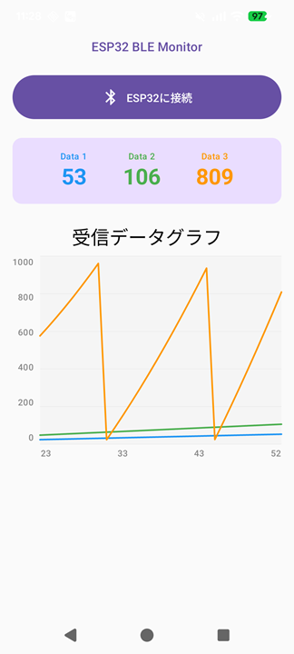

# WaveLinkBLE

# 概要 (Overview)

ESP32マイコンなどとAndroidをBLEで接続し、データの送受信、受信データのグラフ表示などを行うAndroidアプリ

※デバイスが「ESP32に接続」ボタンを押しても接続できない場合、AndroidのBluetoothを一度OFFにして再度ONにすると改善する場合があります

# 機能（Function）

【実装予定】
　★：優先度高
- 受信データ数（グラフの系列数）を可変
- ★グラフの縦横軸をアプリ上で可変
- ★散布図（マイコン側から時刻データを横軸として受信）を作成
- ★折れ線グラフと散布図のアプリ上で表示切替
- ★グラフの横軸スライド（過去データの表示）
- ★アプリからボタンでマイコンへ数値データ送信
- アプリからラジコンのようなイメージで制御データを送信
- ★アプリからBLEデバイスを検索し、ドロップダウンで対象を選択
- データの一時停止（ホールド）機能
- ★データのCSVファイルへのエクスポート
- ログのマーカー（イベント注記）機能
- RSS / 電波強度（RSSI）のリアルタイム表示
- テーマカラーの設定

【実装済み】
- 1～3個のデータをマイコンから受信し折れ線グラフを表示
- 最新の受信データを数値表示
- アプリとマイコンの接続ON/OFF（UUID、デバイス固定）

# ライセンス (License)
This software is released under the MIT License, see LICENSE.